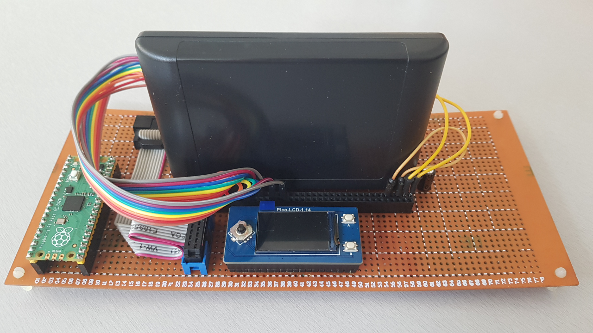
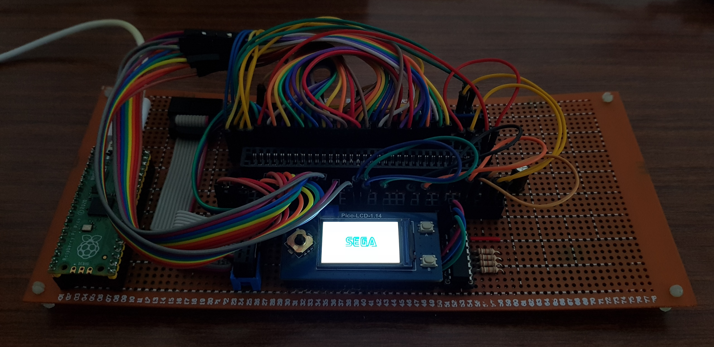

# rp2040 - Mega Drive
 Mega Drive / Genesis cartridges programmer and developer board using Raspberry Pi Pico (rp2040).
 
 

Few comments :
<ul type="square">
<li>Uses x5 - 74HC565</li>
<li>Uses x1 - 74HC165</li>
<li>Numerous top level wires enable rewiring cartridge port. . Prototype card only - mostly for testing purposes and further projects</li>
<li>Firmware ready (read/write rom-flash, read/write ram), GUI interface (PySide6) still to be coded</li>
<li>Currently testing with Fe-RAM added, FlashKit MD card</li> 
</ul>  

 
 

    <kbd></kbd>

 

final prototype card, LCD including buttons added :

    <kbd></kbd>

 

 
